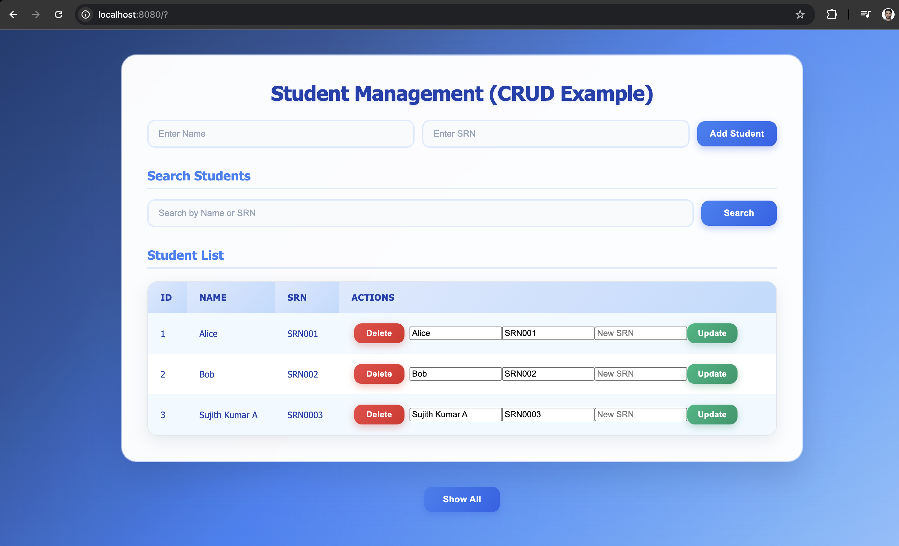

# 🎓 Student Management System

A modern, full-stack web application built with **Java**, **JDBC**, **MySQL**, and **Docker** for managing student records with a beautiful, responsive user interface.

## 🖼️ Application Preview



*Beautiful blue-white themed interface with modern glass-morphism design*

## ✨ Features

- **📝 CRUD Operations**: Create, Read, Update, and Delete student records
- **🔍 Search Functionality**: Search students by name or SRN
- **🎨 Modern UI**: Beautiful, responsive design with glass-morphism effects
- **📱 Mobile Responsive**: Works perfectly on all device sizes
- **🐳 Dockerized**: Easy deployment with Docker Compose
- **🔒 Form Validation**: Client-side validation for data integrity
- **⚡ Real-time Updates**: Instant feedback on all operations

## 🛠️ Tech Stack

- **Backend**: Java 17, JDBC
- **Database**: MySQL 8.0
- **Frontend**: HTML5, CSS3, JavaScript
- **Containerization**: Docker, Docker Compose
- **Styling**: Modern CSS with gradients and glass-morphism

## 🚀 Quick Start

### Prerequisites

- Docker and Docker Compose installed
- Git (for cloning the repository)

### Installation & Running

1. **Clone the repository**
   ```bash
   git clone <repository-url>
   cd jdbc-crud-docker
   ```

2. **Start the application**
   ```bash
   docker-compose up --build
   ```

3. **Access the application**
   - Open your browser and go to: `http://localhost:8080`
   - The application will be ready to use!

### Stopping the Application

```bash
docker-compose down
```

## 📁 Project Structure

```
jdbc-crud-docker/
├── Front-End.png               # Application preview image
├── README.md                   # Project documentation
├── app/
│   ├── Dockerfile              # Java application container
│   ├── Server.java             # Main server application
│   ├── lib/
│   │   └── mysql-connector-j-9.5.0.jar  # MySQL JDBC driver
│   └── web/
│       ├── index.html          # Main HTML template
│       ├── style.css           # Modern CSS styling
│       └── script.js           # Client-side validation
├── db/
│   └── init.sql                # Database initialization script
└── docker-compose.yml          # Docker services configuration
```

## 🎨 UI Features

### Modern Design Elements
- **🔵 Blue-White Theme**: Elegant blue gradient background with white glass-morphism container
- **💎 Glass-morphism**: Frosted glass container with backdrop blur and blue accents
- **🎯 Smooth Animations**: Hover effects and transitions with blue color scheme
- **📐 Perfect Alignment**: Centered layouts and consistent spacing
- **🎨 Color Harmony**: Professional blue-white color scheme with excellent contrast
- **✨ Visual Depth**: Multiple gradient layers and subtle shadows for depth

### Color Scheme
- **🔵 Primary Blue**: Deep navy to sky blue gradient background
- **⚪ Clean White**: Pure white glass-morphism container
- **💙 Accent Blues**: Various blue shades for interactive elements
- **✨ Subtle Overlays**: Blue-tinted radial gradients for depth

### Responsive Design
- **📱 Mobile First**: Optimized for mobile devices
- **💻 Desktop Ready**: Enhanced experience on larger screens
- **🔄 Flexible Layout**: Adapts to different screen sizes

## 🗄️ Database Schema

The application uses a simple MySQL table structure:

```sql
CREATE TABLE students (
    id INT AUTO_INCREMENT PRIMARY KEY,
    name VARCHAR(100) NOT NULL,
    srn VARCHAR(20) NOT NULL UNIQUE
);
```

## 🔧 Configuration

### Environment Variables

The application uses the following environment variables (configured in `docker-compose.yml`):

- `DB_HOST`: MySQL host (default: mysql)
- `DB_PORT`: MySQL port (default: 3306)
- `DB_NAME`: Database name (default: mydb)
- `DB_USER`: Database user (default: root)
- `DB_PASSWORD`: Database password (default: root)

### Port Configuration

- **Application**: `http://localhost:8080`
- **MySQL**: `localhost:3306`

## 📝 Usage Guide

### Adding a Student
1. Enter the student's name in the "Enter Name" field
2. Enter the SRN in the "Enter SRN" field (format: SRN followed by numbers)
3. Click "Add Student" button

### Searching Students
1. Enter search term in the "Search by Name or SRN" field
2. Click "Search" button
3. Results will be displayed in the table below

### Updating a Student
1. Find the student in the table
2. Modify the name or SRN in the input fields
3. Enter a new SRN in the "New SRN" field
4. Click "Update" button

### Deleting a Student
1. Find the student in the table
2. Click the "Delete" button
3. The student will be removed immediately

## 🛡️ Validation Rules

- **Name**: Must be at least 3 characters long
- **SRN**: Must start with "SRN" followed by numbers (e.g., SRN001, SRN123)
- **Required Fields**: Both name and SRN are mandatory

## 🐳 Docker Services

### Java Application (`java_app`)
- **Base Image**: OpenJDK 17
- **Port**: 8080
- **Features**: Custom HTTP server with JDBC connectivity

### MySQL Database (`mysql_db`)
- **Base Image**: MySQL 8.0
- **Port**: 3306
- **Features**: Persistent data storage with automatic initialization

## 🔍 Troubleshooting

### Common Issues

1. **Port Already in Use**
   ```bash
   # Check what's using port 8080
   lsof -i :8080
   # Kill the process or change the port in docker-compose.yml
   ```

2. **Database Connection Issues**
   ```bash
   # Check if MySQL container is running
   docker-compose ps
   # View MySQL logs
   docker-compose logs mysql_db
   ```

3. **Styling Not Loading**
   ```bash
   # Rebuild the containers
   docker-compose down
   docker-compose up --build
   ```

### Logs

View application logs:
```bash
docker-compose logs app
```

View database logs:
```bash
docker-compose logs mysql_db
```

## 🚀 Development

### Making Changes

1. **Frontend Changes**: Edit files in `app/web/` directory
2. **Backend Changes**: Modify `app/Server.java`
3. **Database Changes**: Update `db/init.sql`
4. **Rebuild**: Run `docker-compose up --build`

### Adding New Features

1. Update the Java server code in `Server.java`
2. Modify the HTML template in `app/web/index.html`
3. Add styling in `app/web/style.css`
4. Update this README with new features

## 📄 License

This project is open source and available under the [MIT License](LICENSE).

## 🤝 Contributing

Contributions are welcome! Please feel free to submit a Pull Request.

## 📞 Support

If you encounter any issues or have questions, please open an issue in the repository.

---

**Built with ❤️ using Java, JDBC, MySQL, and Docker**
